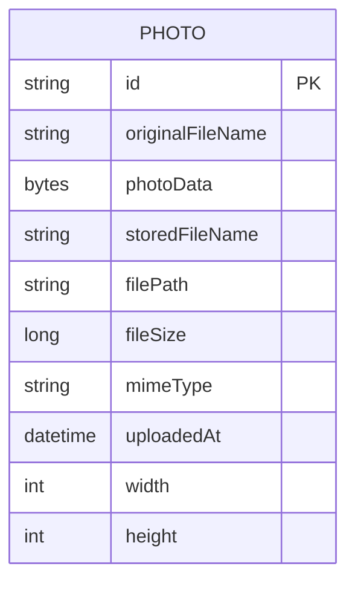

# Data Architecture & Persistence Layer

This document captures the persistence design of the Photo Album application, which uses JPA/Hibernate over Oracle with a compact domain model centered on uploaded photo records.

## Database Configuration

| Service/Module | DB Type | Profile | Driver | Connection | Migration Tool |
|---|---|---|---|---|---|
| photo-album | Oracle | default (`application.properties`) | `oracle.jdbc.OracleDriver` | `jdbc:oracle:thin:@oracle-db:1521/FREEPDB1` | None detected |
| photo-album | Oracle | docker (`application-docker.properties`) | `oracle.jdbc.OracleDriver` | `jdbc:oracle:thin:@oracle-db:1521:XE` | None detected |
| tests | H2 | test scope dependency | H2 driver (test classpath) | In-memory test context | None detected |

## Data Ownership per Service

| Service | Tables Owned | ORM Framework | Caching | Notes |
|---|---|---|---|---|
| photo-album | `PHOTOS` | Spring Data JPA + Hibernate | None detected | Single-service ownership of metadata and BLOB binary content |

## Entity Model

## Key Repository Methods

| Service | Repository | Notable Methods | Purpose |
|---|---|---|---|
| photo-album | `PhotoRepository` (`src/main/java/com/photoalbum/repository/PhotoRepository.java`) | `findAllOrderByUploadedAtDesc()` | Gallery listing ordered by newest upload |
| photo-album | `PhotoRepository` | `findPhotosUploadedBefore(LocalDateTime)` | Previous-photo navigation |
| photo-album | `PhotoRepository` | `findPhotosUploadedAfter(LocalDateTime)` | Next-photo navigation |
| photo-album | `PhotoRepository` | `findPhotosByUploadMonth(String,String)` | Oracle date filtering by month |
| photo-album | `PhotoRepository` | `findPhotosWithPagination(int,int)` | Oracle `ROWNUM`-based pagination |
| photo-album | `PhotoRepository` | `findPhotosWithStatistics()` | Analytical query for size rank and running total |

## Caching Strategy

No application-level cache provider or cache annotations are configured. Reads and writes go directly through JPA/repository queries to Oracle. Browser response headers for `/photo/{id}` explicitly disable HTTP caching.

## Data Ownership Boundaries

The application uses a single database and a single service boundary. There is no cross-service data ownership or inter-service data synchronization; all read/write operations are handled in the same transaction scope managed by `PhotoServiceImpl`.

### Data Classification & Sensitivity

| Entity | Sensitive Fields | Classification (PII/PHI/PCI/None) | Controls in Place |
|---|---|---|---|
| Photo | `originalFileName` (may include personal names), `photoData` (user-uploaded image content) | PII (potential) | No field-level masking/encryption settings found in code/config |

