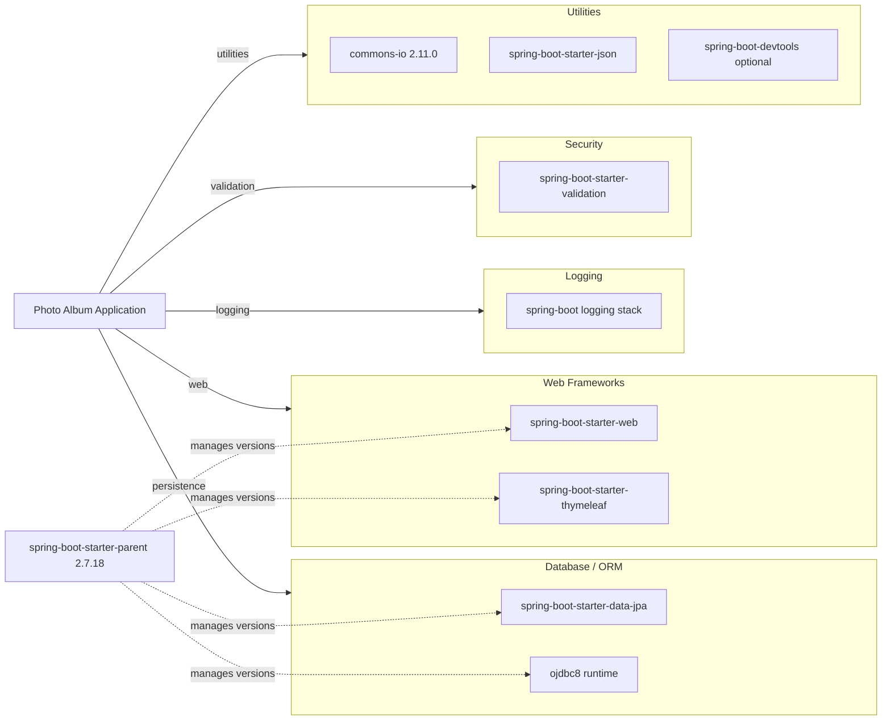

# Dependency Map

This map summarizes declared external dependencies for the Photo Album project and groups them by functional role.

## Dependencies

### Dependency Summary

| Category | Count | Key Libraries | Notes |
|---|---:|---|---|
| Web Frameworks | 2 | spring-boot-starter-web, spring-boot-starter-thymeleaf | MVC web app with server-side rendering |
| Database / ORM | 2 | spring-boot-starter-data-jpa, ojdbc8 | Oracle-centric persistence with Hibernate |
| Logging | 1 | spring-boot logging stack | Managed through Boot starter defaults |
| Security | 1 | spring-boot-starter-validation | Bean validation constraints for uploads/entity fields |
| Utilities | 3 | commons-io, spring-boot-starter-json, devtools | JSON handling, file utilities, local dev support |

### Version & Compatibility Risks

The project targets Java 8 and Spring Boot 2.7.18, which is stable but behind the latest Spring Boot generation. Oracle driver/runtime coupling and Oracle-specific native SQL (`ROWNUM`, `TO_CHAR`, `NVL`) can increase migration complexity when moving to managed cloud databases.

### Notable Observations

- `spring-boot-starter-parent` centrally manages most versions, reducing explicit version drift.
- The persistence layer depends on Oracle-specific behavior, not only generic JPA features.
- `commons-io` is the only explicitly version-pinned third-party utility dependency.

## Test Dependencies

| Framework | Version | Notes |
|---|---|---|
| spring-boot-starter-test | Boot managed | Main test bundle (JUnit Jupiter, assertions, Spring test support) |
| h2 | Boot managed | In-memory database for test profile |

Total test-scope dependencies: 2

Test tooling is minimal and focused on context-load coverage with H2-backed test compatibility.
