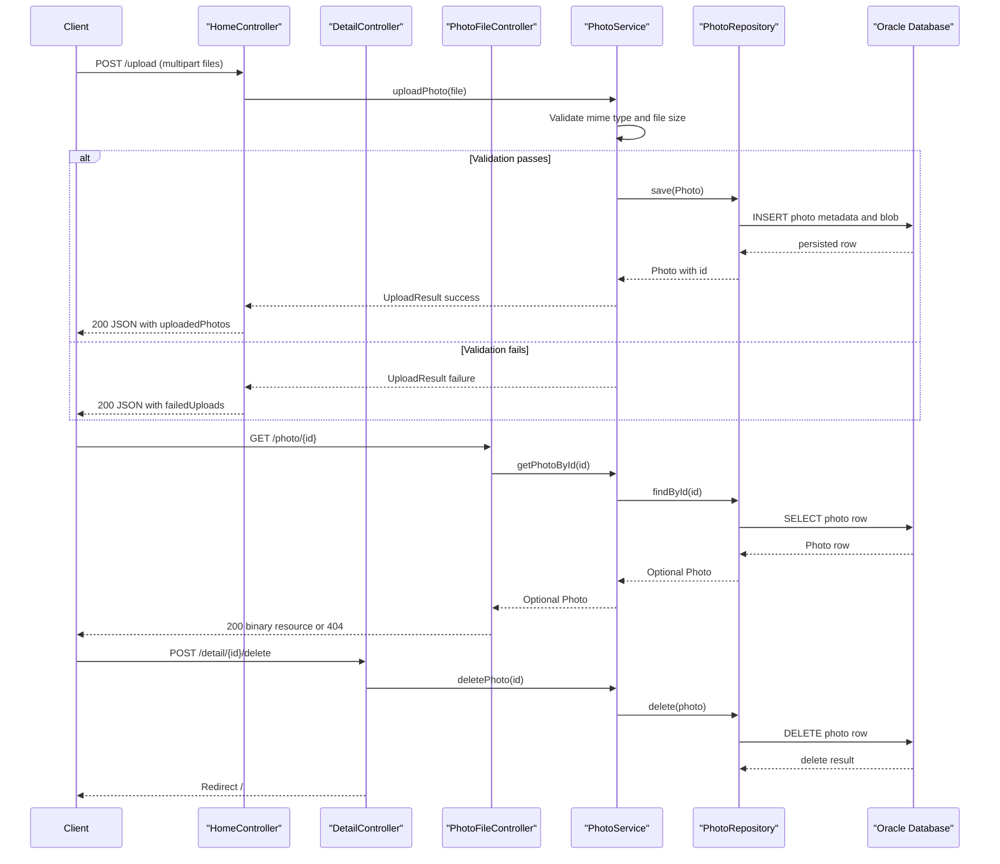

# API & Service Communication Contracts

The application exposes a compact HTTP surface for gallery rendering, image upload, image retrieval, and deletion. Communication is fully synchronous within a single Spring Boot service and directly backed by JPA repository operations.

## Service Catalog

| Service | Port | Category | Purpose |
|---|---:|---|---|
| photo-album (Spring Boot app) | 8080 | Business | Handles UI rendering, upload processing, and photo retrieval/deletion |
| oracle-db (Docker Compose) | 1521 | Infrastructure | Persists photo metadata and binary content |

## API Endpoints Inventory

| Service | Method | Path | Request Type | Response Type |
|---|---|---|---|---|
| HomeController | GET | `/` | None | Thymeleaf `index` view with `photos` and `timestamp` model attributes |
| HomeController | POST | `/upload` | Multipart form field `files` (`List<MultipartFile>`) | `200/400` JSON map containing `success`, `uploadedPhotos`, `failedUploads` |
| DetailController | GET | `/detail/{id}` | Path param `id` (`String`) | Thymeleaf `detail` view or redirect to `/` |
| DetailController | POST | `/detail/{id}/delete` | Path param `id` (`String`) | Redirect to `/` with flash message |
| PhotoFileController | GET | `/photo/{id}` | Path param `id` (`String`) | `200` binary resource (`Resource`) with mime type header, `404`, or `500` |

## Management & Observability Endpoints

| Service | Endpoint | Custom Metrics (if any) |
|---|---|---|
| photo-album | None explicitly configured | None detected |

## DTOs & Contracts

The API contract uses:

- `Photo` as the service-level domain entity returned indirectly through view models and in upload response maps.
- `UploadResult` as a service-level contract object representing upload success/failure and identifiers.
- Response payloads for `/upload` are map-based structures composed in controller code rather than immutable record DTOs.
- No OpenAPI/Swagger specification, protobuf schema, or GraphQL schema was detected.
- Serialization uses Spring Boot JSON defaults (`spring-boot-starter-json`), with no custom serializer configuration identified.

For full entity field definitions and persistence details, see `data-architecture.md`.

## Communication Patterns

The service uses synchronous controller-to-service-to-repository calls with local dependency injection.

- **Synchronous calls**: MVC controllers call `PhotoService` methods directly; the service calls `PhotoRepository` methods for CRUD/native SQL.
- **Asynchronous calls**: none detected (no message broker/event bus patterns).
- **Resilience patterns**: no circuit breaker, retry, bulkhead, or explicit timeout policy libraries were found.
- **Service discovery / gateway**: none detected; endpoints are served directly from one application.
- **Startup dependency chain impact on API availability**: API endpoints require Oracle DB availability at startup; docker-compose enforces DB health before app startup.
- **Security posture**: no API authentication/authorization framework is configured and no HTTPS/TLS termination is defined in application configuration; endpoints are effectively open within the deployed network.

## Service Technology Matrix

| Service | Web | Data Access | Discovery | Gateway | Actuator | Cache | Metrics |
|---|---|---|---|---|---|---|---|
| photo-album | Spring MVC + Thymeleaf | Spring Data JPA + Hibernate | None | None | Not configured | None | Standard logs only |
| oracle-db | N/A | Oracle engine | N/A | N/A | Container healthcheck | N/A | N/A |

## Service Communication Sequence

