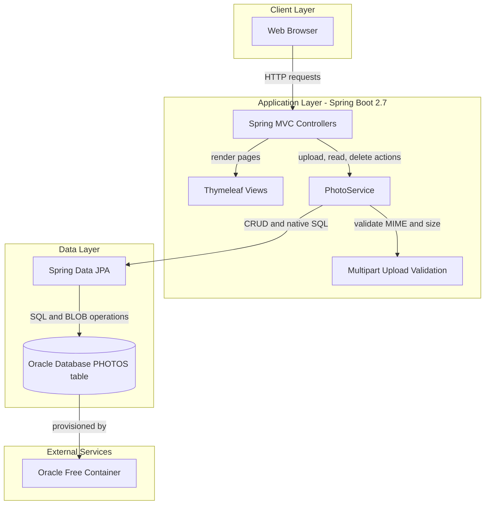
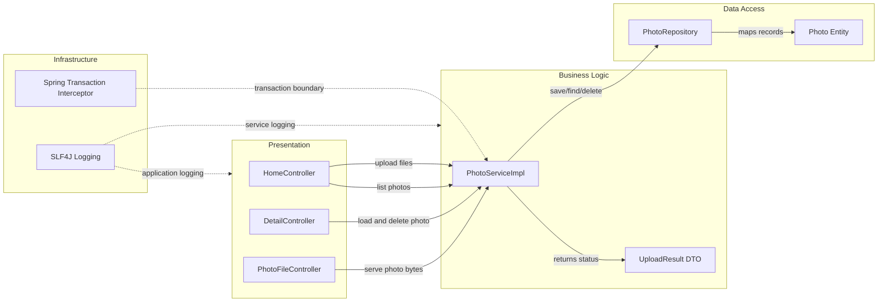

# Architecture Diagram

This application is a single Spring Boot web service that renders Thymeleaf pages and persists photo metadata plus image blobs into Oracle. The architecture is layered around controllers, a photo service, and a JPA repository.

## Application Architecture



### Technology Stack Summary

| Layer | Technology | Version | Purpose |
|---|---|---|---|
| Presentation | Spring MVC + Thymeleaf | Spring Boot 2.7.18 | Serves gallery/detail views and handles upload/delete requests |
| Business Logic | Spring Service + Transaction Management | Spring Framework 5.3.x (via Boot 2.7.18) | Validates uploads and orchestrates persistence operations |
| Data Access | Spring Data JPA + Hibernate | Hibernate 5.6.x (via Boot 2.7.18) | Maps `Photo` entity and executes repository queries |
| Storage | Oracle Database | Oracle Free image (docker-compose) | Stores photo metadata and binary photo data |

### Data Storage & External Services

The application uses one relational data store (Oracle) with a single `Photo` aggregate persisted through JPA. No cache, message broker, or third-party API integration is present; the only external dependency is the Oracle database container/runtime.

### Key Architectural Decisions

- Uses a simple monolith pattern with server-side rendered views instead of separate frontend and backend services.
- Stores photo binary content directly in the database as BLOB (`photo_data`) rather than file-system storage.
- Keeps business logic in a dedicated service layer with `@Transactional` boundaries around repository operations.

## Component Relationships



### Component Inventory

| Component | Layer | Type | Responsibility |
|---|---|---|---|
| HomeController | Presentation | Spring MVC Controller | Serves gallery page and handles multi-file upload response payload |
| DetailController | Presentation | Spring MVC Controller | Shows single-photo detail and deletes selected photo |
| PhotoFileController | Presentation | Spring MVC Controller | Streams photo bytes from database to HTTP response |
| PhotoServiceImpl | Business Logic | Spring Service | Enforces file validation and orchestrates repository operations |
| UploadResult | Business Logic | DTO/Model | Represents upload outcome and error/success metadata |
| PhotoRepository | Data Access | Spring Data JPA Repository | Executes CRUD plus custom native SQL queries |
| Photo | Data Access | JPA Entity | Represents persisted photo metadata and BLOB content |
```
