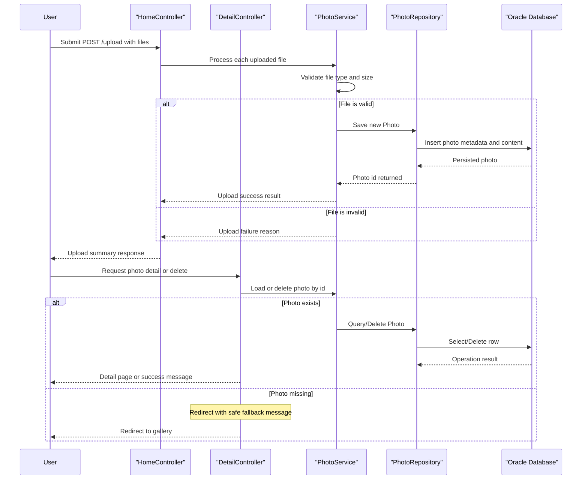

# Core Business Workflows

The application supports a photo gallery use case where users upload images, browse all photos, open a detailed view, and remove photos when needed. Workflows are centered on photo lifecycle management from upload validation through persistence and presentation.

## Domain Entities

| Entity | Service / Bounded Context | Description | Key Relationships |
|---|---|---|---|
| Photo | photo-album / Photo Management | Core business object representing an uploaded image and its metadata | Referenced by gallery listing, detail navigation, and file streaming workflows |
| UploadResult | photo-album / Upload Processing | Outcome object communicating success/failure for each upload attempt | Produced by upload workflow and consumed by API response composition |

## Service-to-Domain Mapping

| Service | Domain Context | Owned Entities | External Dependencies |
|---|---|---|---|
| HomeController + PhotoService | Gallery and Upload Management | Photo, UploadResult | PhotoRepository, Oracle database |
| DetailController + PhotoService | Photo Detail and Deletion | Photo | PhotoRepository, Oracle database |
| PhotoFileController + PhotoService | Photo Delivery | Photo | PhotoRepository, Oracle database |

## Primary Workflows

### Workflow 1: Upload Photos to Gallery

1. User submits `POST /upload` with one or more image files.
2. Service validates each file type and size according to configured upload rules.
3. For valid files, service extracts image metadata, creates `Photo`, and persists it.
4. Controller returns a combined result containing successful uploads and failures.
5. Business rule: upload succeeds per-file, allowing partial success in a multi-file request.

### Workflow 2: Browse and View Photo Details

1. User opens `GET /` to view gallery.
2. Service retrieves photos ordered by upload timestamp descending.
3. User opens `GET /detail/{id}` for a selected photo.
4. Service loads current photo and computes previous/next navigation targets.
5. Business rule: missing/invalid photo ID falls back to gallery redirect.

### Workflow 3: Delete a Photo

1. User submits `POST /detail/{id}/delete`.
2. Service checks whether the photo exists.
3. Existing photo is deleted from persistence and user receives success flash message.
4. Missing photo returns a not-found style flash message.
5. Business rule: delete is idempotent from user perspective (safe fallback message when already missing).

## Cross-Service Data Flows

No cross-service composition is present because the system is a single deployable service with one backing database. Data flow remains internal: controllers delegate to the service layer, which performs persistence actions through repository operations and returns domain objects to presentation responses.

## Business Workflow Sequence

## Business Rules & Decision Logic

- Upload processing enforces MIME-type and max-size rules before persistence.
- Multi-file upload handles each file independently, allowing mixed success/failure results.
- Detail workflow requires non-empty IDs and existing records; invalid or missing IDs redirect to gallery.
- Delete workflow checks existence first and communicates result through flash messages.
- Service methods run inside transactional boundaries for consistency of create/read/delete operations.
