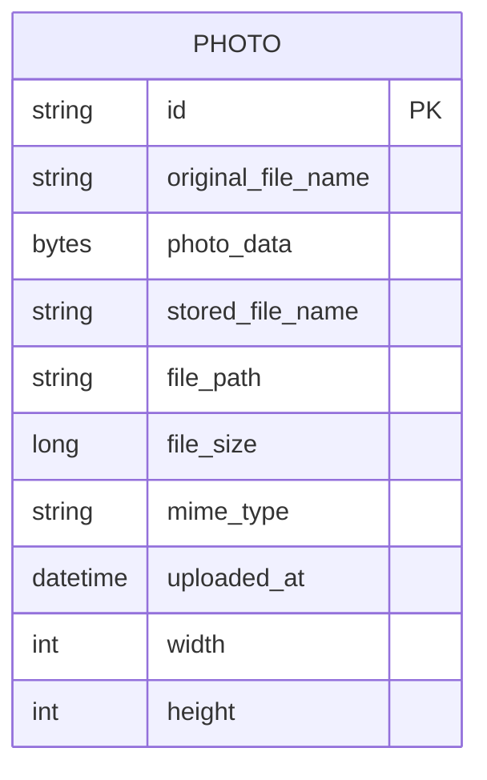

# Data Architecture & Persistence Layer

The persistence layer is centered on a single JPA entity persisted to Oracle, with Hibernate handling ORM mapping and transaction boundaries managed in the service layer. The data model is intentionally simple and optimized for storing image metadata plus binary content.

## Database Configuration

| Service/Module | DB Type | Profile | Driver | Connection | Migration Tool |
|---|---|---|---|---|---|
| photo-album | Oracle | default | Oracle JDBC (`ojdbc8`) | JDBC host `oracle-db`, port `1521`, service `FREEPDB1` | None detected |
| photo-album | Oracle | docker | Oracle JDBC (`ojdbc8`) | JDBC host `oracle-db`, port `1521`, SID/service `XE` | None detected |
| tests | H2 (in-memory) | test scope | H2 driver (test dependency) | In-memory test DB managed by Spring test runtime | None detected |

## Data Ownership per Service

| Service | Tables Owned | ORM Framework | Caching | Notes |
|---|---|---|---|---|
| photo-album | `PHOTOS` | Spring Data JPA / Hibernate | None detected | Single-service ownership of all persisted records |

## Entity Model

Source file: `src/main/java/com/photoalbum/model/Photo.java`

## Key Repository Methods

| Service | Repository | Notable Methods | Purpose |
|---|---|---|---|
| photo-album | `PhotoRepository` (`src/main/java/com/photoalbum/repository/PhotoRepository.java`) | `findAllOrderByUploadedAtDesc()` | Returns gallery photos newest-first using Oracle native SQL |
| photo-album | `PhotoRepository` | `findPhotosUploadedBefore(LocalDateTime uploadedAt)` | Fetches older photos for previous-photo navigation |
| photo-album | `PhotoRepository` | `findPhotosUploadedAfter(LocalDateTime uploadedAt)` | Fetches newer photos for next-photo navigation |
| photo-album | `PhotoRepository` | `findPhotosByUploadMonth(String year, String month)` | Oracle `TO_CHAR` query for month-based filtering |
| photo-album | `PhotoRepository` | `findPhotosWithPagination(int startRow, int endRow)` | Oracle `ROWNUM`-based pagination query |
| photo-album | `PhotoRepository` | `findPhotosWithStatistics()` | Uses Oracle analytical functions for ranking and running totals |

## Caching Strategy

No explicit caching provider or caching annotation strategy was detected.

- Cache provider: none
- Cache patterns: none
- TTL/eviction configuration: none
- Hibernate second-level cache: not configured

## Data Ownership Boundaries

Data store topology is single-database and single-service, with no cross-service direct database access.

- Shared vs isolated stores: one Oracle schema used by one service.
- Cross-service data access: not applicable; no additional internal services.
- Read/write pattern: standard transactional CRUD plus custom read queries.

### Data Classification & Sensitivity

| Entity | Sensitive Fields | Classification (PII/PHI/PCI/None) | Controls in Place |
|---|---|---|---|
| Photo | `originalFileName` (may include personal naming), `photoData` (uploaded image content) | PII (potential) | No explicit encryption-at-rest, masking, or field-level access controls detected in code/config |

