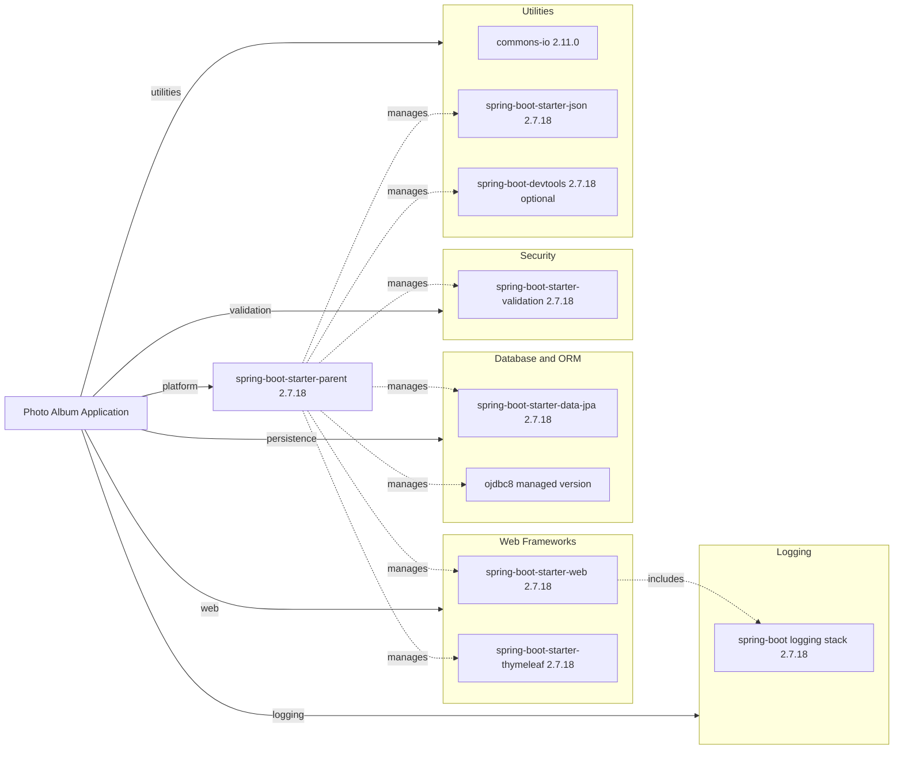

# Dependency Map

Photo Album declares a focused Maven dependency set centered on Spring Boot web and persistence capabilities, with additional utility and Oracle runtime support. The project has 8 non-test declared dependencies and 2 test-scoped dependencies.

## Dependencies

### Dependency Summary

| Category | Count | Key Libraries | Notes |
|---|---:|---|---|
| Web Frameworks | 2 | spring-boot-starter-web, spring-boot-starter-thymeleaf | MVC controllers and server-rendered pages |
| Database / ORM | 2 | spring-boot-starter-data-jpa, ojdbc8 | JPA/Hibernate with Oracle runtime driver |
| Logging | 1 | Spring Boot default logging stack | Transitively provided through starter stack |
| Security | 1 | spring-boot-starter-validation | Bean validation for model and upload rules |
| Utilities | 3 | commons-io, spring-boot-starter-json, spring-boot-devtools | IO helpers, JSON support, local dev convenience |

### Version & Compatibility Risks

The project targets Java 8 and Spring Boot 2.7.18, which is in maintenance mode compared to newer Spring Boot generations. Oracle driver version is managed transitively and should be reviewed during modernization to ensure compatibility with target Java runtime and cloud-hosted Oracle options.

### Notable Observations

- Oracle-specific dependency and SQL usage indicate strong coupling to Oracle behavior.
- No explicit messaging, caching, or service discovery dependencies are declared.
- DevTools is optional and suitable for local development but should remain excluded from production packaging.
- Dependency footprint is small, which reduces migration complexity.

## Test Dependencies

| Framework | Version | Notes |
|---|---|---|
| spring-boot-starter-test | 2.7.18 | Aggregates JUnit, assertions, and Spring test support |
| h2 | managed by Spring Boot BOM | In-memory database used for test execution |

Total test-scope dependencies: 2

The test setup is lightweight and relies on the Spring Boot test starter with H2 for isolated test runs.
