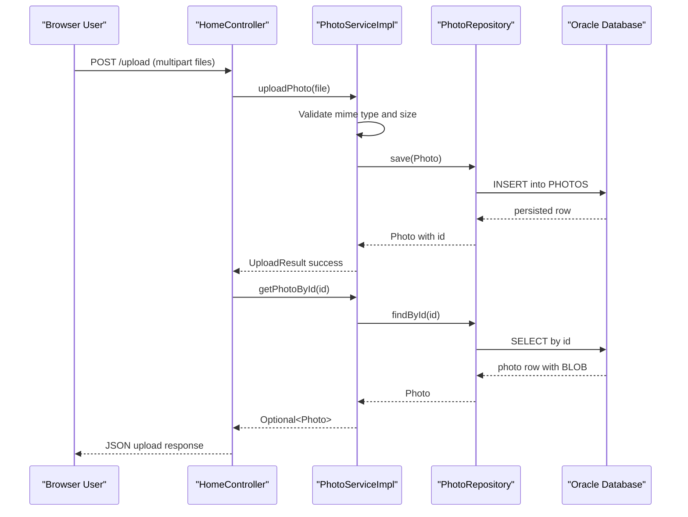

# API & Service Communication Contracts

The application exposes a small HTTP API surface for viewing, uploading, serving, and deleting photos. Communication is synchronous in-process between controller, service, and repository layers.

## Service Catalog

| Service | Port | Category | Purpose |
|---|---:|---|---|
| photoalbum-java-app | 8080 | API Layer | Serves web UI endpoints and photo upload/file delivery endpoints |
| oracle-db | 1521 | Infrastructure | Persists photo metadata and binary data |

## API Endpoints Inventory

| Service | Method | Path | Request Type | Response Type |
|---|---|---|---|---|
| photoalbum-java-app | GET | `/` | None | HTML view (`index`) with photo list model |
| photoalbum-java-app | POST | `/upload` | Multipart form data (`files`: list of `MultipartFile`) | JSON object with upload success/failed lists |
| photoalbum-java-app | GET | `/detail/{id}` | Path parameter (`id`) | HTML view (`detail`) or redirect |
| photoalbum-java-app | POST | `/detail/{id}/delete` | Path parameter (`id`) | Redirect to `/` with flash message |
| photoalbum-java-app | GET | `/photo/{id}` | Path parameter (`id`) | Binary resource body with image content type |

## Management & Observability Endpoints

| Service | Endpoint | Custom Metrics (if any) |
|---|---|---|
| photoalbum-java-app | None detected (Actuator not declared) | None detected |

## DTOs & Contracts

The main API contract models are:

- `Photo`: service-level domain entity used as the response model for page rendering and file retrieval context.
- `UploadResult`: service-level result model used to represent per-file upload success/failure.
- `Map<String, Object>` response payload in `/upload`: gateway-level API response envelope that aggregates uploaded photo metadata and failed upload details.

No OpenAPI specification, protobuf schema, or GraphQL schema was detected. JSON serialization is provided by Spring Boot Jackson defaults.

## Communication Patterns

The application uses synchronous REST-style HTTP requests handled by Spring MVC controllers. Controllers call `PhotoService`, which delegates persistence operations to `PhotoRepository` and Oracle. No asynchronous messaging, circuit breaker, retry policy, or service discovery mechanism was detected. Startup dependency for API availability is Oracle database readiness (enforced in Docker Compose with health-check-based `depends_on`). Security posture: no TLS termination, authentication, or authorization controls were found in the application layer; endpoints are publicly accessible within the deployed network.

## Service Technology Matrix

| Service | Web | Data Access | Discovery | Gateway | Actuator | Cache | Metrics |
|---|---|---|---|---|---|---|---|
| photoalbum-java-app | Spring MVC + Thymeleaf | Spring Data JPA + Oracle JDBC | None | None | No | None | Logging only |
| oracle-db | N/A | N/A | N/A | N/A | N/A | N/A | N/A |

## Service Communication Sequence

