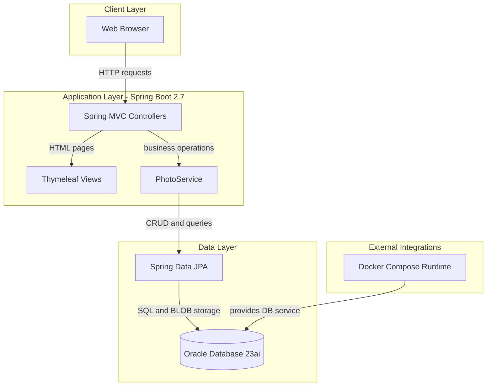
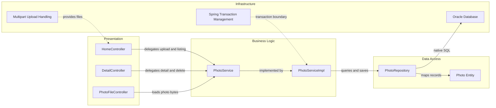

# Architecture Diagram

This document summarizes the current application architecture and key component interactions for the Photo Album application.

## Application Architecture

### Technology Stack Summary

| Layer | Technology | Version | Purpose |
|---|---|---|---|
| Presentation | Spring MVC + Thymeleaf | Spring Boot 2.7.18 | Serves gallery pages and upload responses |
| Business Logic | PhotoService | Project code | Validates uploads and coordinates persistence |
| Data Access | Spring Data JPA + Hibernate | Spring Boot managed | Repository abstraction and ORM |
| Database | Oracle Database | Oracle Free image latest | Stores photo metadata and binary photo data |
| Runtime | Docker Compose | Compose spec | Local multi-container orchestration |

### Data Storage & External Services

The application stores all photo metadata and photo binary content in an Oracle database table (`PHOTOS`). A Docker Compose service provides the Oracle database runtime dependency for local and containerized execution.

### Key Architectural Decisions

- Uses a layered MVC → service → repository pattern with constructor-based dependency injection.
- Stores image bytes directly in Oracle as BLOB data instead of filesystem storage.
- Uses profile-based configuration (`docker`) to switch runtime connectivity for container execution.

## Component Relationships

### Component Inventory

| Component | Layer | Type | Responsibility |
|---|---|---|---|
| HomeController | Presentation | MVC Controller | Renders gallery and handles multi-file upload endpoint |
| DetailController | Presentation | MVC Controller | Renders single-photo detail page and delete action |
| PhotoFileController | Presentation | MVC Controller | Streams photo binary content by photo id |
| PhotoService | Business Logic | Service Interface | Defines photo retrieval, upload, navigation, and delete contracts |
| PhotoServiceImpl | Business Logic | Service Implementation | Validates files, extracts metadata, persists and retrieves photos |
| PhotoRepository | Data Access | Spring Data Repository | Executes photo CRUD and custom native queries |
| Photo | Data Access | JPA Entity | Represents stored photo metadata and BLOB content |
