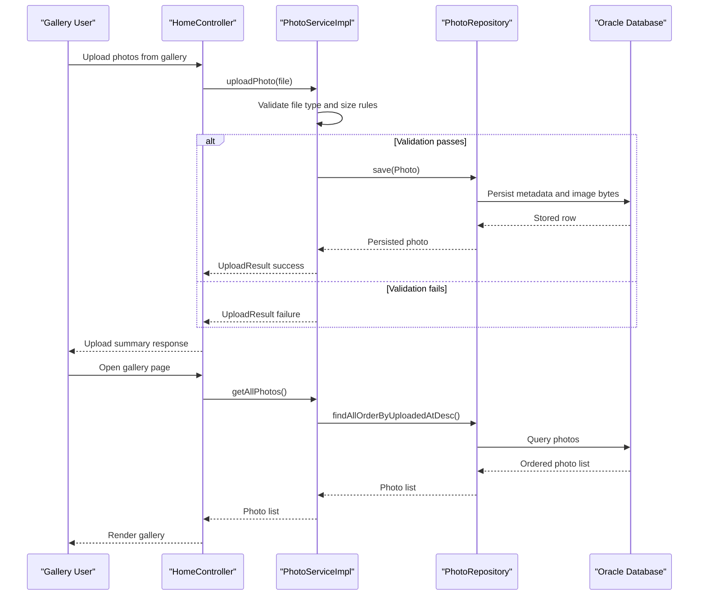

# Core Business Workflows

The application supports a photo gallery business domain where users upload, browse, view, and delete personal photos. Core workflows revolve around validating user uploads and maintaining a chronological photo collection.

## Domain Entities

| Entity | Service / Bounded Context | Description | Key Relationships |
|---|---|---|---|
| Photo | Photo Management | Represents a user-uploaded photo asset with metadata and binary content | Primary entity used by gallery, detail, file serving, and deletion workflows |
| UploadResult | Photo Management | Captures per-file upload success/failure outcomes | Produced by upload workflow and aggregated into API response |

## Service-to-Domain Mapping

| Service | Domain Context | Owned Entities | External Dependencies |
|---|---|---|---|
| HomeController + PhotoServiceImpl | Gallery and Upload Management | Photo, UploadResult | PhotoRepository, Oracle DB |
| DetailController + PhotoServiceImpl | Photo Detail and Deletion | Photo | PhotoRepository, Oracle DB |
| PhotoFileController + PhotoServiceImpl | Photo Delivery | Photo | PhotoRepository, Oracle DB |

## Primary Workflows

### Workflow 1: Upload Photos to Gallery

1. User submits one or more files from the gallery page.
2. `HomeController` loops through each file and calls `PhotoService.uploadPhoto`.
3. Service validates mime type, file size, and non-empty content.
4. Service reads bytes, extracts dimensions when possible, then persists a `Photo` record.
5. Controller builds a response with uploaded and failed items and returns JSON.

### Workflow 2: Browse and View Photo Details

1. User opens `/` to view photos ordered by most recent upload.
2. User opens `/detail/{id}` to view one photo.
3. Service loads selected photo and computes previous/next navigation candidates by upload timestamp.
4. Detail page renders current photo and navigation links.

### Workflow 3: Delete Photo

1. User submits delete action from detail page.
2. `DetailController` calls `PhotoService.deletePhoto(id)`.
3. Service checks existence and deletes matching photo.
4. User is redirected back to gallery with success or error message.

## Cross-Service Data Flows

The application is a single-service design and does not perform cross-service data composition. All workflow data is sourced from the local service boundary and Oracle datastore. If Oracle is unavailable, workflows degrade by failing read/write operations and returning redirects or error responses.

## Business Workflow Sequence

## Business Rules & Decision Logic

- Upload accepts only configured image mime types (`jpeg`, `png`, `gif`, `webp`).
- Upload rejects empty files and files larger than configured max size.
- Gallery ordering and navigation are driven by `uploadedAt` chronology.
- Deletion only succeeds when target photo exists; otherwise user receives a not-found style message.
- Transaction management is applied at service level (`@Transactional`) for consistent persistence behavior.
