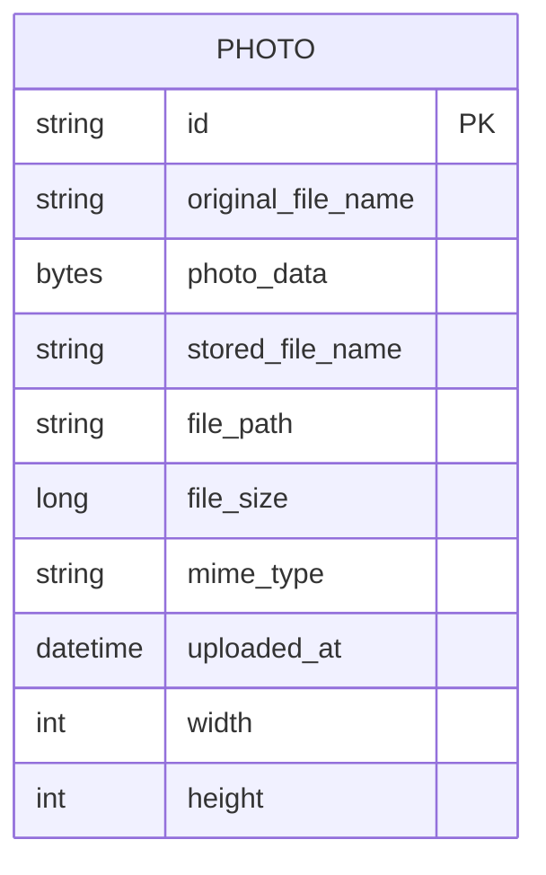

# Data Architecture & Persistence Layer

This document summarizes the data layer for the Photo Album application, which uses a single relational data model with JPA/Hibernate over Oracle. The persistence model centers on one primary entity that stores both photo metadata and image binary data.

## Database Configuration

| Service/Module | DB Type | Profile | Driver | Connection | Migration Tool |
|---|---|---|---|---|---|
| photo-album | Oracle | default | Oracle JDBC (`ojdbc8`) | JDBC URL to `oracle-db:1521/FREEPDB1` | None detected |
| photo-album | Oracle | docker | Oracle JDBC (`ojdbc8`) | JDBC URL to `oracle-db:1521:XE` | None detected |
| photo-album tests | H2 (test scope dependency) | test | H2 driver | In-memory test database | None detected |

## Data Ownership per Service

| Service | Tables Owned | ORM Framework | Caching | Notes |
|---|---|---|---|---|
| photoalbum-java-app | `PHOTOS` | Spring Data JPA / Hibernate | None detected | Single-service ownership; stores BLOB image payloads in DB |

## Entity Model

## Key Repository Methods

| Service | Repository | Notable Methods | Purpose |
|---|---|---|---|
| photoalbum-java-app | `PhotoRepository` (`src/main/java/com/photoalbum/repository/PhotoRepository.java`) | `findAllOrderByUploadedAtDesc()` | Returns gallery list ordered by newest upload |
| photoalbum-java-app | `PhotoRepository` | `findPhotosUploadedBefore(LocalDateTime uploadedAt)` | Retrieves previous photo candidates for detail navigation |
| photoalbum-java-app | `PhotoRepository` | `findPhotosUploadedAfter(LocalDateTime uploadedAt)` | Retrieves next photo candidates for detail navigation |
| photoalbum-java-app | `PhotoRepository` | `findPhotosByUploadMonth(String year, String month)` | Oracle `TO_CHAR` based month filtering |
| photoalbum-java-app | `PhotoRepository` | `findPhotosWithPagination(int startRow, int endRow)` | Oracle `ROWNUM` pagination query |
| photoalbum-java-app | `PhotoRepository` | `findPhotosWithStatistics()` | Oracle analytic functions for ranking and running totals |

## Caching Strategy

No dedicated cache provider or cache annotations (`@Cacheable`, `@CacheEvict`) were detected. Reads and writes are served directly through JPA repository calls to Oracle. Any response caching behavior is client/HTTP-header oriented (`no-cache` for photo streaming) rather than server-side data caching.

## Data Ownership Boundaries

The application uses a single shared datastore model with one owning service (`photoalbum-java-app`). There are no cross-service database ownership boundaries, no CQRS split, and no cross-service data joins. All read and write operations are handled within the same service boundary through repository methods.

### Data Classification & Sensitivity

| Entity | Sensitive Fields | Classification (PII/PHI/PCI/None) | Controls in Place |
|---|---|---|---|
| Photo | `originalFileName` may include user-identifying text; `photo_data` may contain personal images | PII (potential) | No explicit field-level masking or encryption controls detected in code/config |

