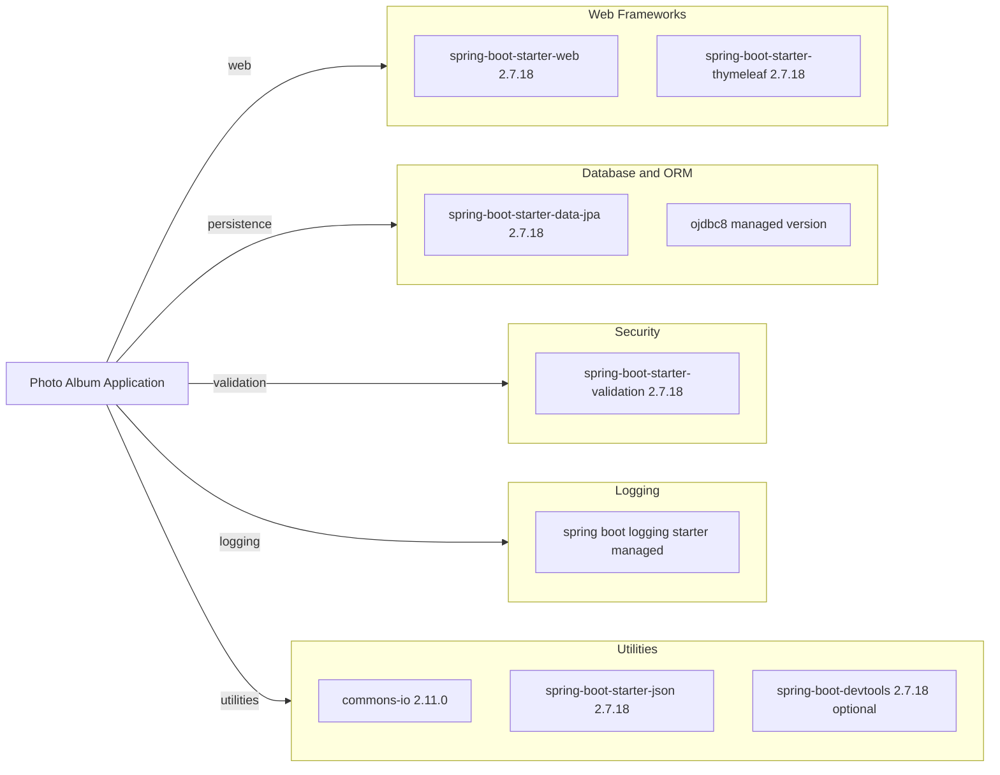

# Dependency Map

This document summarizes declared external dependencies for the Photo Album project. The project declares 8 non-test dependencies (including optional/runtime scoped entries).

## Dependencies

### Dependency Summary

| Category | Count | Key Libraries | Notes |
|---|---:|---|---|
| Web Frameworks | 2 | spring-boot-starter-web, spring-boot-starter-thymeleaf | MVC web app with server-rendered views |
| Database / ORM | 2 | spring-boot-starter-data-jpa, ojdbc8 | JPA/Hibernate with Oracle JDBC runtime driver |
| Security | 1 | spring-boot-starter-validation | Bean validation for model and input constraints |
| Logging | 1 | spring boot logging starter | Logging stack is managed transitively by Spring Boot |
| Utilities | 3 | commons-io, spring-boot-starter-json, spring-boot-devtools | File helpers, JSON, and development convenience |

### Version & Compatibility Risks

The project targets Java 8 and Spring Boot 2.7.18. Spring Boot 2.7 is in maintenance mode and Java 8 limits modernization options for newer Azure platform features and libraries. Oracle JDBC version is managed transitively, so explicit compatibility checks should be performed when upgrading framework/runtime baselines.

### Notable Observations

- Oracle database coupling is strong through both the Oracle driver and multiple Oracle-specific native SQL queries.
- `spring-boot-devtools` is declared as optional and should stay excluded from production packaging.
- The dependency set is compact; most behavior comes from Spring Boot managed transitive dependencies.

## Test Dependencies

| Framework | Version | Notes |
|---|---|---|
| spring-boot-starter-test | 2.7.18 | Aggregates JUnit and Spring test utilities |
| h2 | managed version | In-memory database for tests |

Total test-scope dependencies: 2

The project has a lightweight test dependency stack centered on Spring Boot test support with H2 for isolated data-layer testing.
