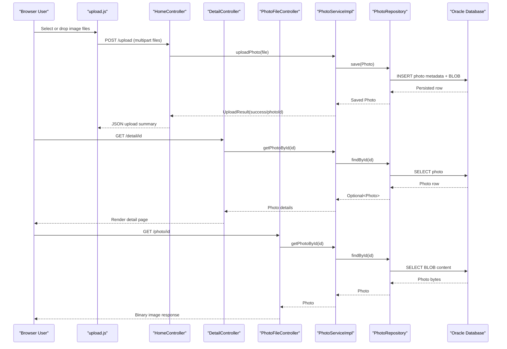

# API & Service Communication Contracts

This application exposes a compact HTTP API surface over a single Spring MVC service, with primarily synchronous request-response communication between browser clients and server controllers.

## Service Catalog

| Service | Port | Category | Purpose |
|---|---:|---|---|
| Photo Album Web App (`photo-album`) | 8080 | API Layer + Business | Serves gallery/detail pages, accepts uploads, and streams photo content |

## API Endpoints Inventory

| Service | Method | Path | Request Type | Response Type |
|---|---|---|---|---|
| Photo Album Web App | GET | `/` | None | Thymeleaf HTML view (`index`) |
| Photo Album Web App | POST | `/upload` | Multipart form with `files` collection | JSON object with `success`, `uploadedPhotos`, `failedUploads` |
| Photo Album Web App | GET | `/detail/{id}` | Path parameter `id` | Thymeleaf HTML view (`detail`) or redirect |
| Photo Album Web App | POST | `/detail/{id}/delete` | Path parameter `id` | Redirect to `/` with flash message |
| Photo Album Web App | GET | `/photo/{id}` | Path parameter `id` | Binary resource (`image/*`) with headers |

## Management & Observability Endpoints

| Service | Endpoint | Custom Metrics (if any) |
|---|---|---|
| Photo Album Web App | None explicitly configured in source | None detected |

## DTOs & Contracts

The API contract is centered on the domain model `Photo` plus upload response wrapper `UploadResult`. `Photo` acts as both persistence model and response payload source for HTML/JSON rendering paths, while `UploadResult` encapsulates per-file upload outcomes before response aggregation in `HomeController`. No dedicated immutable DTO layer, OpenAPI specification, protobuf schema, or GraphQL schema is present. Serialization for JSON responses relies on Spring Boot's default Jackson stack.

## Communication Patterns

All discovered communication is synchronous HTTP between browser clients and controller endpoints, followed by in-process service and repository invocation. There are no asynchronous messaging patterns, service discovery components, API gateway layers, or circuit-breaker/retry libraries configured. Startup dependency concerns are minimal: API availability depends on successful database connectivity at application startup. Security posture at API contract level is open by default—no explicit authentication, authorization, or TLS enforcement is configured in the application code.

## Service Technology Matrix

| Service | Web | Data Access | Discovery | Gateway | Actuator | Cache | Metrics |
|---|---|---|---|---|---|---|---|
| Photo Album Web App | Spring MVC + Thymeleaf | Spring Data JPA (Oracle) | None | No | Not configured | None detected | None detected |

## Service Communication Sequence

