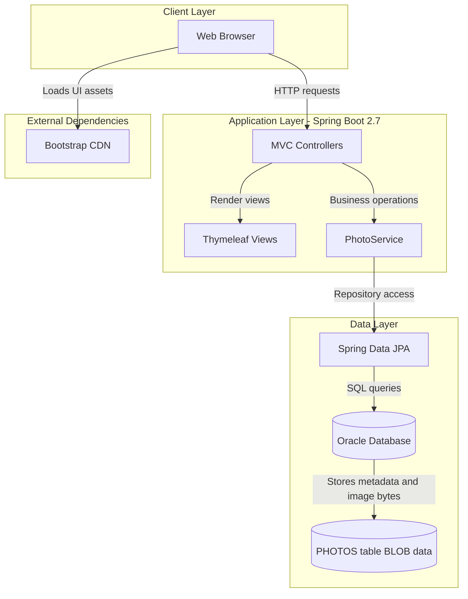
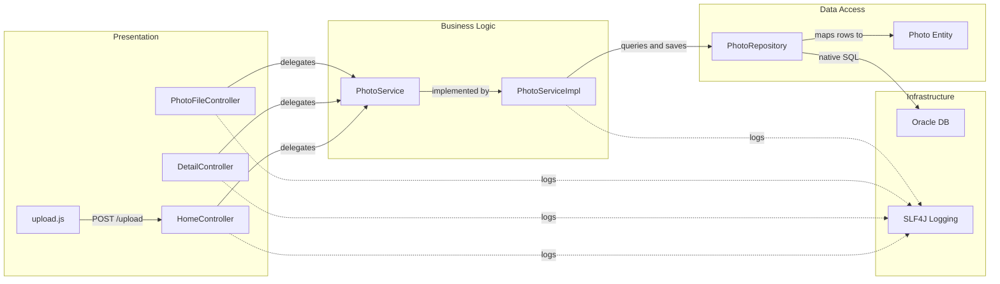

# Architecture Diagram

This document summarizes the current Photo Album application structure and the key component interactions discovered from the codebase.

## Application Architecture

### Technology Stack Summary

| Layer | Technology | Version | Purpose |
|---|---|---|---|
| Presentation | Spring MVC + Thymeleaf | Spring Boot 2.7.18 | Serves gallery/detail pages and handles form uploads |
| Business | Spring Service Layer | Spring Framework 5.3.x (via Boot 2.7.18) | Validates uploads, coordinates persistence, navigation, and deletion |
| Data Access | Spring Data JPA + Hibernate | Hibernate 5.6.x (via Boot 2.7.18) | Maps `Photo` entity and executes repository queries |
| Database | Oracle | Configured via JDBC driver `ojdbc8` | Stores photo metadata and binary image content |
| Client Assets | Bootstrap | 5.3.0 (CDN) | UI styling and layout |

### Data Storage & External Services

The application persists all photo metadata and file bytes in an Oracle database table (`PHOTOS`) through JPA/Hibernate. There is no separate cache, message broker, or external API integration in the current implementation; the primary external runtime dependency is the Bootstrap CDN used by the web UI.

### Key Architectural Decisions

- Uses a classic layered Spring MVC design with controllers delegating to a single photo-focused service.
- Stores image binaries directly in database BLOB columns instead of external object storage.
- Uses Thymeleaf server-side rendering for both gallery and detail experiences.

## Component Relationships

### Component Inventory

| Component | Layer | Type | Responsibility |
|---|---|---|---|
| `HomeController` | Presentation | MVC Controller | Renders gallery and handles multi-file upload API |
| `DetailController` | Presentation | MVC Controller | Displays photo detail, navigation, and deletion |
| `PhotoFileController` | Presentation | MVC Controller | Streams image bytes by photo ID |
| `upload.js` | Presentation | Frontend Script | Handles drag-drop selection, client validation, and async upload |
| `PhotoService` | Business | Service Interface | Defines photo upload/query/delete/navigation operations |
| `PhotoServiceImpl` | Business | Service Implementation | Executes validation, image dimension extraction, and persistence orchestration |
| `PhotoRepository` | Data Access | Spring Data Repository | Executes CRUD and custom native Oracle queries |
| `Photo` | Data Access | JPA Entity | Represents persisted photo metadata and BLOB content |
| Oracle DB | Infrastructure | Database | Stores all application photo data |
| SLF4J Logger | Infrastructure | Cross-cutting | Captures operational and error logs across layers |
