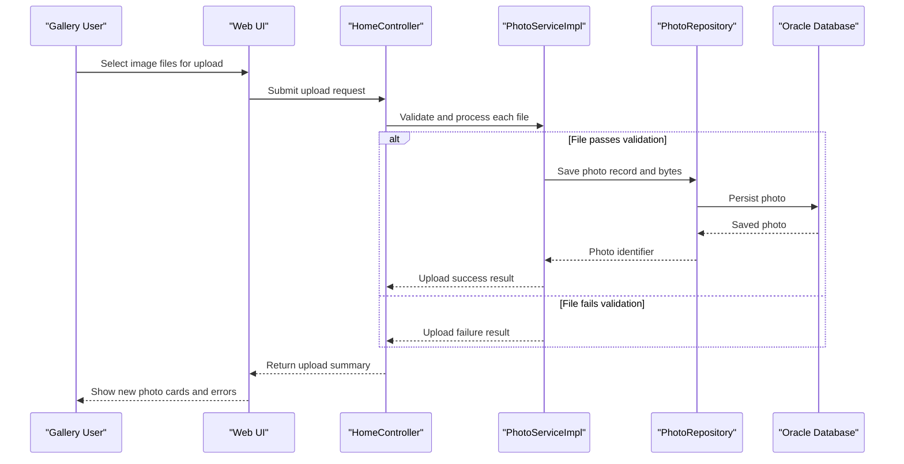

# Core Business Workflows

The application supports a photo gallery business flow where users upload, browse, view, and delete images with immediate persistence and retrieval behavior.

## Domain Entities

| Entity | Service / Bounded Context | Description | Key Relationships |
|---|---|---|---|
| Photo | Photo Management | Core asset representing a stored image and display metadata | Used by gallery listing, detail viewing, navigation, and deletion flows |
| UploadResult | Photo Management | Upload outcome contract for each submitted file | Connects upload validation result to API/UI feedback |

## Service-to-Domain Mapping

| Service | Domain Context | Owned Entities | External Dependencies |
|---|---|---|---|
| Photo Album Web App | Photo Management | `Photo`, `UploadResult` | Oracle persistence via repository layer |

## Primary Workflows

### Workflow 1: Upload Photos to Gallery

User submits one or more image files through the upload area. The system performs file type/size checks, reads image bytes, persists each valid photo, and returns success and failure details so the UI can immediately update gallery cards.

### Workflow 2: Browse and View Photo Details

User opens the gallery, then selects a photo to view the detail page. The system retrieves the selected photo and determines previous/next navigation candidates to enable browsing the collection sequence.

### Workflow 3: Delete Photo

User confirms delete action on detail view. The system removes the photo record and binary data, then redirects back to the gallery with status feedback.

## Cross-Service Data Flows

The solution is a single-service architecture, so there is no inter-service aggregation flow. Business data composition happens inside one service boundary: controllers gather upload and lookup results, then return either HTML view models or JSON payloads to the browser.

## Business Workflow Sequence

## Business Rules & Decision Logic

- Only supported image MIME types (JPEG, PNG, GIF, WebP) are accepted for upload.
- Uploaded file size must not exceed configured maximum threshold; empty files are rejected.
- Upload success requires successful persistence; failures are surfaced per file while allowing other files in the same batch to continue.
- Detail navigation rule provides previous/next photos based on upload timestamp ordering.
- Deletion succeeds only when target photo exists; otherwise user receives not-found feedback.
