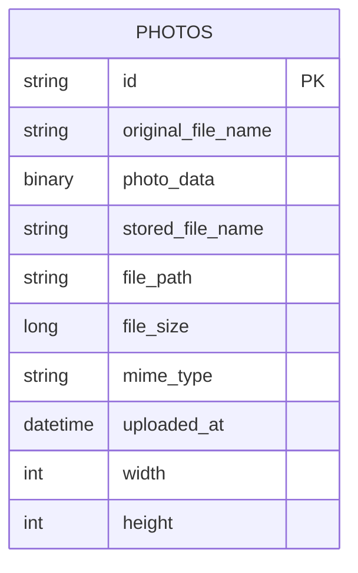

# Data Architecture & Persistence Layer

The data layer uses a single relational Oracle database accessed through Spring Data JPA/Hibernate, with one primary entity model for persisted photo records and associated binary content.

## Database Configuration

| Service/Module | DB Type | Profile | Driver | Connection | Migration Tool |
|---|---|---|---|---|---|
| `photo-album` | Oracle | default (`application.properties`) | `oracle.jdbc.OracleDriver` (`ojdbc8`) | JDBC Thin connection to Oracle service (`oracle-db:1521`) | None detected (schema managed by Hibernate behavior) |
| `photo-album` | Oracle | docker (`application-docker.properties`) | `oracle.jdbc.OracleDriver` (`ojdbc8`) | JDBC Thin connection to Oracle XE service (`oracle-db:1521`) | None detected (schema managed by Hibernate behavior) |
| tests | H2 | test scope via Maven dependency | H2 embedded driver | In-memory test database from Spring test configuration | None detected |

## Data Ownership per Service

| Service | Tables Owned | ORM Framework | Caching | Notes |
|---|---|---|---|---|
| Photo Album Web App | `PHOTOS` | Spring Data JPA + Hibernate | None detected | Single-service ownership; image bytes stored in BLOB column |

## Entity Model

## Key Repository Methods

| Service | Repository | Notable Methods | Purpose |
|---|---|---|---|
| Photo Album Web App | `PhotoRepository` (`src/main/java/com/photoalbum/repository/PhotoRepository.java`) | `findAllOrderByUploadedAtDesc()` | Returns gallery photos newest-first using native Oracle SQL |
| Photo Album Web App | `PhotoRepository` | `findPhotosUploadedBefore(LocalDateTime)` | Supports previous-photo navigation query window |
| Photo Album Web App | `PhotoRepository` | `findPhotosUploadedAfter(LocalDateTime)` | Supports next-photo navigation query window |
| Photo Album Web App | `PhotoRepository` | `findPhotosByUploadMonth(String,String)` | Executes Oracle `TO_CHAR`-based month filtering |
| Photo Album Web App | `PhotoRepository` | `findPhotosWithPagination(int,int)` | Implements Oracle `ROWNUM` pagination |
| Photo Album Web App | `PhotoRepository` | `findPhotosWithStatistics()` | Uses Oracle analytic functions for ranking/running totals |

## Caching Strategy

No explicit cache provider or cache annotations were detected in the current implementation. Data reads are served directly from the Oracle database through repository queries.

## Data Ownership Boundaries

The application uses a single shared relational data store owned by one deployable service; there are no additional microservices or separate bounded-context databases. All reads and writes to persisted photo data occur through the `PhotoServiceImpl` and `PhotoRepository` path, with no cross-service direct database access patterns in scope.

### Data Classification & Sensitivity

| Entity | Sensitive Fields | Classification (PII/PHI/PCI/None) | Controls in Place |
|---|---|---|---|
| `Photo` | `originalFileName`, `photoData` | Potentially sensitive user content (PII-like user-provided content) | No explicit field masking or encryption controls found in application code |

