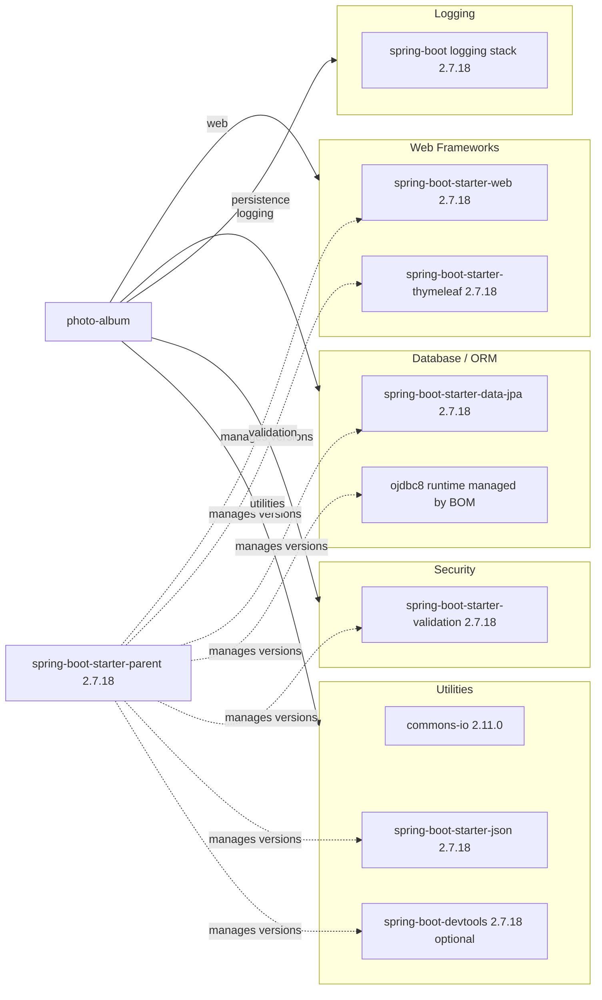

# Dependency Map

This document summarizes declared external dependencies for the Photo Album project and groups them by functional role. The project declares 10 direct dependencies in `pom.xml`, including test-scoped libraries.

## Dependencies

### Dependency Summary

| Category | Count | Key Libraries | Notes |
|---|---:|---|---|
| Web Frameworks | 2 | spring-boot-starter-web, spring-boot-starter-thymeleaf | MVC web app with server-rendered UI |
| Database / ORM | 2 | spring-boot-starter-data-jpa, ojdbc8 | Oracle-focused persistence and JPA mapping |
| Logging | 1 | spring-boot logging stack | Logging transitively provided by Spring Boot starter chain |
| Security | 1 | spring-boot-starter-validation | Bean validation used for input/data integrity |
| Utilities | 3 | commons-io, spring-boot-starter-json, spring-boot-devtools | File handling, JSON serialization, and development productivity |

### Version & Compatibility Risks

The project is pinned to Java 8 and Spring Boot 2.7.18, which is an older generation and commonly flagged for modernization to newer LTS baselines. Oracle coupling is strong via `ojdbc8` plus Oracle-specific SQL in repositories, which may increase migration complexity to other database targets.

### Notable Observations

- Version management is centralized through `spring-boot-starter-parent`, reducing explicit version declarations.
- `commons-io` is explicitly versioned while most other dependencies are BOM-managed.
- DevTools is included as optional; it should remain excluded from production runtime packaging.
- No explicit caching, messaging, or observability dependency is currently declared.

## Test Dependencies

| Framework | Version | Notes |
|---|---|---|
| spring-boot-starter-test | 2.7.18 | Primary Spring test bundle (JUnit/Mock support via managed transitive dependencies) |
| H2 | Managed by Spring Boot 2.7.18 BOM | In-memory database for test scope |

Total test-scope dependencies: 2

The test stack is lightweight and focused on Spring Boot defaults. No dedicated integration-test container framework is declared in this project.
