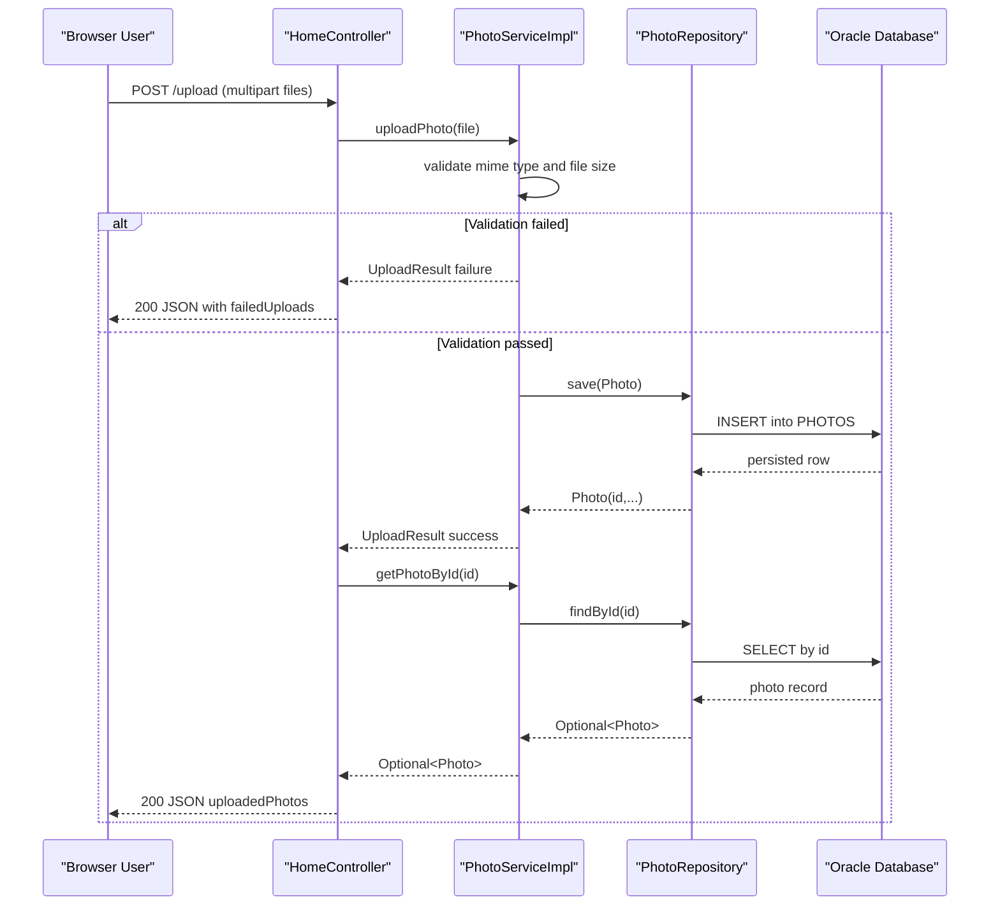

# API & Service Communication Contracts

The application exposes a compact HTTP surface for gallery rendering, upload processing, detail navigation, and binary photo retrieval. Communication is synchronous and in-process between MVC controllers, service, and repository layers.

## Service Catalog

| Service | Port | Category | Purpose |
| --- | --- | --- | --- |
| photo-album (single Spring Boot module) | 8080 | API Layer + Business | Serves UI pages, handles uploads/deletes, retrieves and streams photo content |

## API Endpoints Inventory

| Service | Method | Path | Request Type | Response Type |
| --- | --- | --- | --- | --- |
| photo-album / HomeController | GET | `/` | None | Thymeleaf `index` view model with `photos` list |
| photo-album / HomeController | POST | `/upload` | `multipart/form-data` with `files[]` | JSON map containing `success`, `uploadedPhotos`, `failedUploads` |
| photo-album / DetailController | GET | `/detail/{id}` | Path parameter `id` | Thymeleaf `detail` view or redirect `/` |
| photo-album / DetailController | POST | `/detail/{id}/delete` | Path parameter `id` | Redirect `/` with flash message |
| photo-album / PhotoFileController | GET | `/photo/{id}` | Path parameter `id` | Binary response (`Resource`) with image MIME type or 404/500 |

## Management & Observability Endpoints

| Service | Endpoint | Custom Metrics (if any) |
| --- | --- | --- |
| photo-album | None discovered (`/actuator/*` not configured in project files) | None discovered |

## DTOs & Contracts

- **Request/response contract types**:
  - `UploadResult`: mutable service response DTO for upload outcomes (success flag, file name, message, generated photo ID).
  - `Photo`: domain entity also used in API/view contracts (model attributes and upload response assembly).
- **Gateway-level DTOs**: none (single-service application, no aggregation gateway module).
- **Immutability**: DTOs/entities are mutable classes with setters; no Java records or immutable value-object pattern detected.
- **Serialization**: Spring Boot starter JSON (Jackson) provides JSON serialization for `@ResponseBody` upload responses.
- **Schema contracts**: no OpenAPI/Swagger spec, protobuf, or GraphQL schema files found.

## Communication Patterns

- **Synchronous patterns**: HTTP request -> controller -> `PhotoService` -> `PhotoRepository` -> Oracle DB.
- **Asynchronous patterns**: none detected (no queue/event framework dependencies).
- **Resilience patterns**: no circuit breaker, retry, timeout policy library, or fallback handlers detected in API path.
- **Service discovery/gateway**: none; all interactions are in a single local process.
- **Startup dependency chain impact on API availability**: app startup depends on Oracle connectivity (via datasource and JPA initialization) when running with Oracle profile.
- **Security posture**: no authentication, authorization, or HTTPS/TLS enforcement is configured at the application API layer; endpoints are publicly reachable within deployment boundary.

## Service Technology Matrix

| Service | Web | Data Access | Discovery | Gateway | Actuator | Cache | Metrics |
| --- | --- | --- | --- | --- | --- | --- | --- |
| photo-album | Spring MVC + Thymeleaf | Spring Data JPA (Oracle) | None | None | No | None | No explicit metrics export |

## Service Communication Sequence

