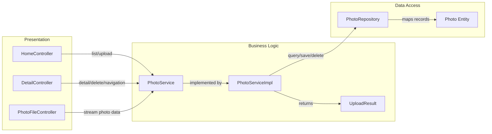

# Architecture Diagram

This application is a single-module Spring Boot photo gallery that serves HTML pages and binary photo content while persisting photo metadata and BLOB data in Oracle.

## Application Architecture

```mermaid
flowchart TD
    subgraph Client["Client Layer"]
        Browser["Web Browser"]
    end

    subgraph App["Application Layer - Spring Boot 2.7"]
        MVC["Spring MVC Controllers"]
        Service["PhotoService"]
        View["Thymeleaf Views"]
    end

    subgraph Data["Data Layer"]
        Repo["Spring Data JPA Repository"]
        Oracle[("Oracle Database PHOTOS table")]
    end

    Browser -->|"GET /"| MVC
    Browser -->|"POST /upload"| MVC
    MVC -->|"render"| View
    MVC -->|"delegate operations"| Service
    Service -->|"CRUD and queries"| Repo
    Repo -->|"SQL via Hibernate/Oracle driver"| Oracle
    MVC -->|"stream image bytes"| Browser
```

### Technology Stack Summary

| Layer | Technology | Version | Purpose |
| --- | --- | --- | --- |
| Presentation | Spring MVC + Thymeleaf | Spring Boot 2.7.18 | Serves gallery/detail pages and upload endpoints |
| Business Logic | PhotoService / PhotoServiceImpl | Application code | Upload validation, image metadata extraction, navigation |
| Data Access | Spring Data JPA + Hibernate | Spring Boot 2.7.18 managed | Repository abstraction and ORM integration |
| Database | Oracle Database via ojdbc8 | Runtime dependency | Stores photo metadata and photo BLOB payload |
| Runtime | Java | 8 | Application runtime target |

### Data Storage & External Services

The application stores all photo metadata and binary image content in a single Oracle database schema/table (`PHOTOS`). No message broker, cache service, or third-party API integration is implemented in the current codebase.

### Key Architectural Decisions

- Uses a single deployable Spring Boot service instead of a distributed microservice topology.
- Stores images as Oracle BLOBs for transactional consistency between metadata and file content.
- Keeps navigation and listing logic in repository-native Oracle SQL queries optimized by upload timestamp indexing.

## Component Relationships

### Component Inventory

| Component | Layer | Type | Responsibility |
| --- | --- | --- | --- |
| HomeController | Presentation | MVC Controller | Gallery page rendering and multi-file upload API |
| DetailController | Presentation | MVC Controller | Photo detail page, previous/next navigation, delete action |
| PhotoFileController | Presentation | MVC Controller | Streams photo bytes from database as HTTP resources |
| PhotoService | Business Logic | Service Interface | Contract for photo retrieval, upload, delete, navigation |
| PhotoServiceImpl | Business Logic | Service Implementation | Validation, image parsing, transaction-scoped persistence |
| UploadResult | Business Logic | DTO | Encapsulates upload success/failure responses |
| PhotoRepository | Data Access | Spring Data Repository | Oracle-specific query execution and persistence operations |
| Photo | Data Access | JPA Entity | Persistent photo metadata and BLOB payload model |
