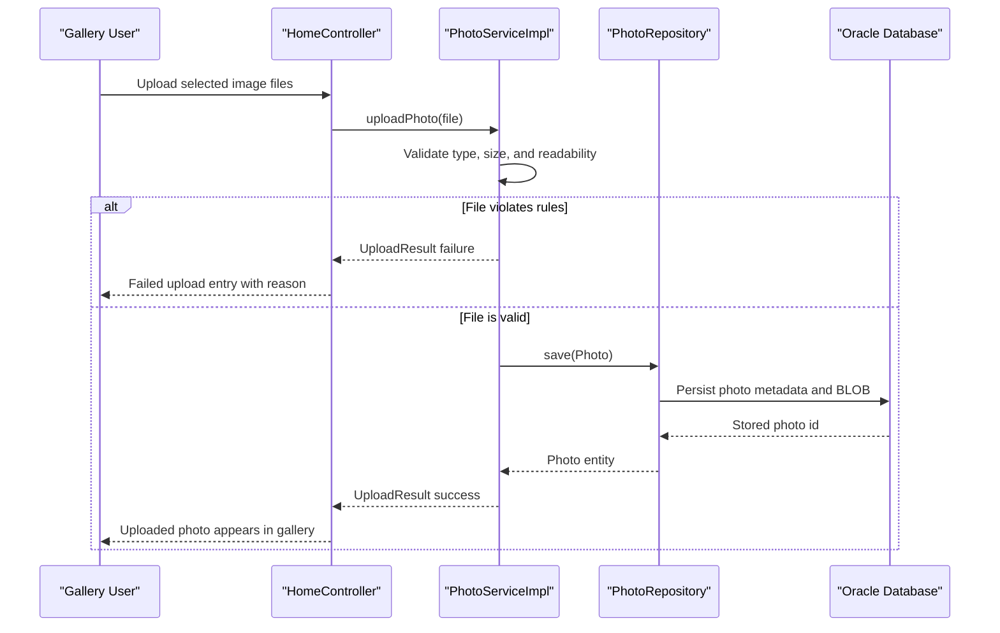

# Core Business Workflows

The application supports a simple photo-management domain where users upload images, browse them in a gallery, inspect detailed metadata, and delete entries.

## Domain Entities

| Entity | Service / Bounded Context | Description | Key Relationships |
| --- | --- | --- | --- |
| Photo | Photo Management | Core aggregate representing an uploaded image and display metadata | Referenced across gallery, detail, navigation, and delete workflows |
| UploadResult | Photo Management | Operation result object for upload outcome reporting | Returned by upload processing and translated into API response payload |

## Service-to-Domain Mapping

| Service | Domain Context | Owned Entities | External Dependencies |
| --- | --- | --- | --- |
| photo-album | Photo Management | `Photo`, `UploadResult` | Oracle database via repository layer |

## Primary Workflows

### Workflow 1: Upload Photos

1. User submits one or more files to `POST /upload`.
2. Service validates MIME type and file size, then verifies file content readability.
3. Service creates a new `Photo` record with generated UUID and extracted dimensions.
4. Repository persists the record; controller returns success/failed item lists.

### Workflow 2: Browse and View Details

1. User opens `GET /` to render gallery items sorted by newest upload.
2. User navigates to `GET /detail/{id}` for full-size view.
3. Service retrieves current photo and adjacent previous/next records to enable navigation.

### Workflow 3: Delete Photo

1. User triggers `POST /detail/{id}/delete`.
2. Service verifies entity exists, then deletes repository record.
3. UI redirects to gallery with success or error flash message.

## Cross-Service Data Flows

No cross-service composition flow exists because this is a single-service application. Data flow remains internal from controller to service to repository to Oracle and back, with no downstream service fan-out or circuit-breaker fallback branches.

## Business Workflow Sequence

## Business Rules & Decision Logic

- Upload is rejected when MIME type is not in allowed list (`jpeg/png/gif/webp`).
- Upload is rejected when file size exceeds configured max bytes or file is empty.
- On detail view, missing/invalid IDs redirect back to gallery instead of exposing error pages.
- Deletion returns user-facing success/error messages based on entity existence and operation outcome.
- Photo ordering and navigation are time-based (`uploadedAt` descending/adjacent queries).
