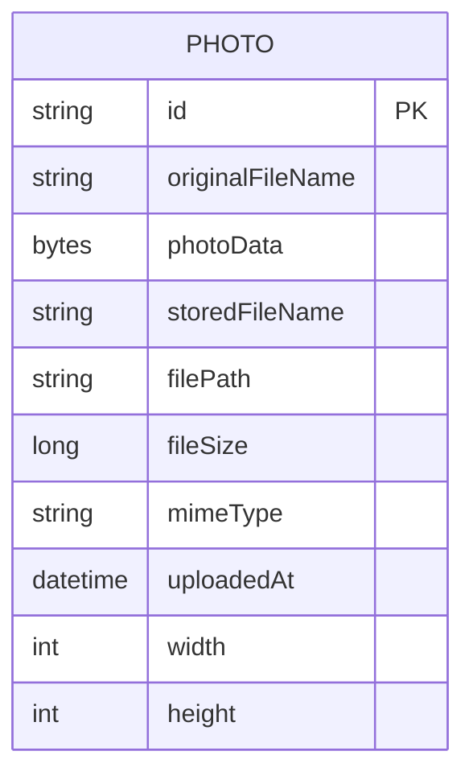

# Data Architecture & Persistence Layer

The data layer uses Spring Data JPA with Hibernate against Oracle and persists both metadata and binary photo content in a single `Photo` entity/table model.

## Database Configuration

| Service/Module | DB Type | Profile | Driver | Connection | Migration Tool |
| --- | --- | --- | --- | --- | --- |
| photo-album | Oracle | default | `oracle.jdbc.OracleDriver` (`ojdbc8`) | JDBC URL points to `oracle-db:1521/FREEPDB1` | None detected (schema managed by JPA/Hibernate behavior) |
| photo-album | Oracle | docker (`SPRING_PROFILES_ACTIVE=docker`) | `oracle.jdbc.OracleDriver` | JDBC URL points to `oracle-db:1521:XE` | None detected |
| tests | H2 in-memory | test | `org.h2.Driver` | `jdbc:h2:mem:testdb` | None detected |

## Data Ownership per Service

| Service | Tables Owned | ORM Framework | Caching | Notes |
| --- | --- | --- | --- | --- |
| photo-album | `PHOTOS` | Spring Data JPA + Hibernate | None | Single-service ownership; no cross-service table sharing |

## Entity Model

## Key Repository Methods

| Service | Repository | Notable Methods | Purpose |
| --- | --- | --- | --- |
| photo-album | `PhotoRepository` (`src/main/java/com/photoalbum/repository/PhotoRepository.java`) | `findAllOrderByUploadedAtDesc()` | Gallery listing ordered by newest upload |
| photo-album | `PhotoRepository` | `findPhotosUploadedBefore(LocalDateTime)` | Previous-photo navigation query |
| photo-album | `PhotoRepository` | `findPhotosUploadedAfter(LocalDateTime)` | Next-photo navigation query |
| photo-album | `PhotoRepository` | `findPhotosByUploadMonth(String,String)` | Oracle `TO_CHAR` based monthly filtering |
| photo-album | `PhotoRepository` | `findPhotosWithPagination(int,int)` | Oracle `ROWNUM` pagination strategy |
| photo-album | `PhotoRepository` | `findPhotosWithStatistics()` | Oracle analytic functions for ranking/running totals |

## Caching Strategy

No application-level caching provider or cache annotations were detected. All read operations hit the repository/database directly, and photo binary payload retrieval is performed on demand.

## Data Ownership Boundaries

The application uses a single shared datastore pattern because there is only one deployable service. Read/write operations are centrally handled through `PhotoRepository`, and no cross-service API composition or direct cross-database access patterns exist.

### Data Classification & Sensitivity

| Entity | Sensitive Fields | Classification (PII/PHI/PCI/None) | Controls in Place |
| --- | --- | --- | --- |
| Photo | `originalFileName` (can contain user-identifiable naming), `photoData` (image content may include personal information) | PII (potential) | No explicit field-level masking or encryption-at-rest configuration in application code |

