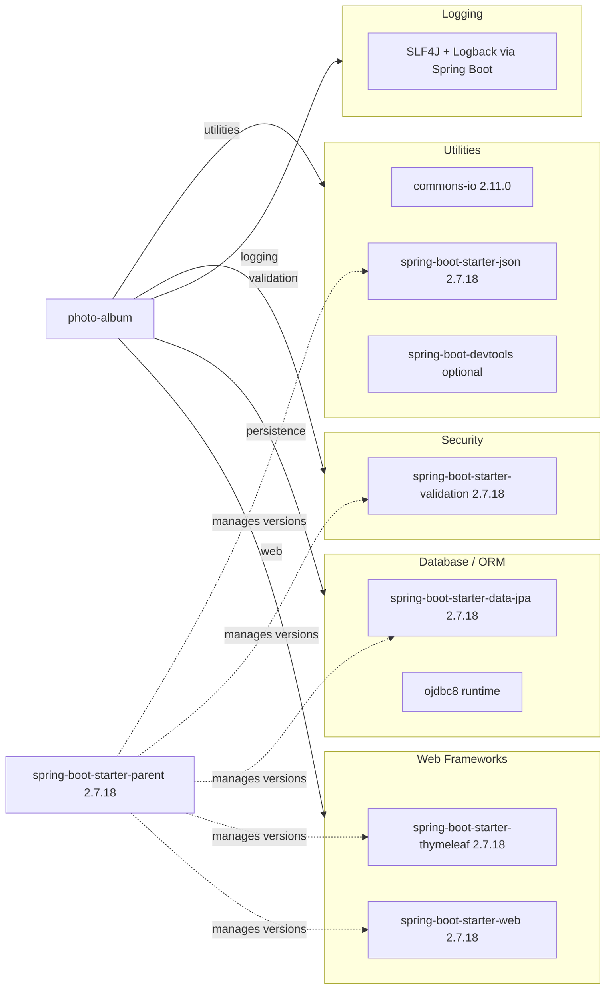

# Dependency Map

This single-module Maven project declares 8 primary runtime/compile dependencies (excluding test-scope entries) centered on Spring Boot web, persistence, and validation capabilities.

## Dependencies

### Dependency Summary

| Category | Count | Key Libraries | Notes |
| --- | --- | --- | --- |
| Web Frameworks | 2 | spring-boot-starter-web, spring-boot-starter-thymeleaf | Server-rendered MVC web app |
| Database / ORM | 2 | spring-boot-starter-data-jpa, ojdbc8 | Oracle-backed JPA persistence |
| Logging | 1 | SLF4J/Logback (via Spring Boot) | Default Boot logging stack |
| Security | 1 | spring-boot-starter-validation | Bean validation for upload constraints |
| Utilities | 3 | commons-io, spring-boot-starter-json, devtools | File helpers and runtime convenience |

### Version & Compatibility Risks

The project targets Java 8 and Spring Boot 2.7.18, both of which increase migration friction for modern Azure runtimes and current framework ecosystems. Oracle-specific SQL usage in repository queries also creates portability concerns if database platform changes are required.

### Notable Observations

- `spring-boot-starter-parent` centralizes most transitive versions, simplifying upgrades but coupling many components to the same release train.
- `ojdbc8` is runtime-scoped and ties deployment to Oracle connectivity and driver compatibility.
- `spring-boot-devtools` is optional and should remain excluded from production container images.
- No explicit messaging/caching dependencies are declared.

## Test Dependencies

| Framework | Version | Notes |
| --- | --- | --- |
| spring-boot-starter-test | 2.7.18 | Aggregates JUnit, Mockito, Spring Test support |
| h2 | managed by Spring Boot BOM | In-memory database used in test profile |

Total test-scope dependencies: 2

Test infrastructure is lightweight and focused on Spring Boot context startup plus H2-backed persistence compatibility.
