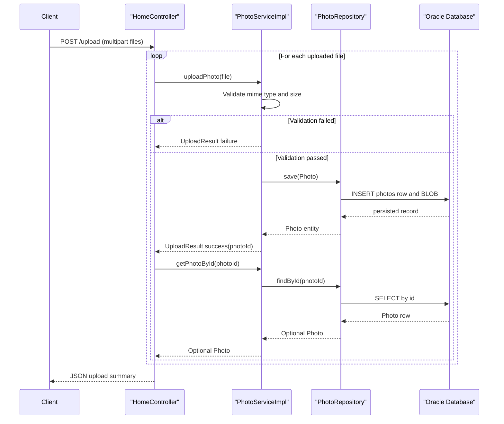

# API & Service Communication Contracts

The application exposes a small server-rendered web API surface with three controllers and synchronous request handling. Communication is primarily browser-to-monolith HTTP with in-process service and repository calls.

## Service Catalog

| Service | Port | Category | Purpose |
|---|---:|---|---|
| photo-album (single Spring Boot module) | 8080 | API Layer + Business | Serves gallery UI, uploads photos, streams image content, and deletes photos |
| oracle-db (Docker dependency) | 1521 | Infrastructure | Persists photo metadata and BLOB payloads |

## API Endpoints Inventory

| Service | Method | Path | Request Type | Response Type |
|---|---|---|---|---|
| photo-album (HomeController) | GET | `/` | None | Thymeleaf HTML view (`index`) |
| photo-album (HomeController) | POST | `/upload` | Multipart form field `files` (`List<MultipartFile>`) | JSON map with success, uploadedPhotos, failedUploads |
| photo-album (DetailController) | GET | `/detail/{id}` | Path param `id` | Thymeleaf HTML view (`detail`) or redirect |
| photo-album (DetailController) | POST | `/detail/{id}/delete` | Path param `id` | Redirect to `/` with flash message |
| photo-album (PhotoFileController) | GET | `/photo/{id}` | Path param `id` | Binary resource with MIME type headers or 404/500 |

## Management & Observability Endpoints

| Service | Endpoint | Custom Metrics (if any) |
|---|---|---|
| photo-album | Not explicitly configured | None detected |

## DTOs & Contracts

The API uses domain and response objects directly rather than a separate external contract package. `UploadResult` acts as upload operation status payload and `Photo` is used as the service-level domain entity returned to views and transformed into response maps for JSON upload responses. No immutable DTO records, OpenAPI/Swagger specs, protobuf schemas, or GraphQL schemas were detected. Serialization is handled by Spring Boot JSON infrastructure (Jackson via starter dependencies).

## Communication Patterns

All runtime communication patterns are synchronous: Browser -> Spring MVC Controllers -> `PhotoServiceImpl` -> `PhotoRepository` -> Oracle DB. No asynchronous messaging, event buses, circuit breakers, retry policies, or explicit timeout policies were found in code/configuration. Service discovery and API gateway patterns are not present because deployment is a single monolith. Startup API availability depends on Oracle readiness in Docker Compose (`depends_on` with healthy DB). Security posture: no explicit API authentication, authorization annotations, or TLS configuration were found in the app configuration, so endpoints appear publicly accessible within the deployment network unless protected externally.

## Service Technology Matrix

| Service | Web | Data Access | Discovery | Gateway | Actuator | Cache | Metrics |
|---|---|---|---|---|---|---|---|
| photo-album | Spring MVC + Thymeleaf | Spring Data JPA + Oracle JDBC | none | none | none detected | none detected | none detected |
| oracle-db | n/a | Oracle DB engine | n/a | n/a | container healthcheck | n/a | n/a |

## Service Communication Sequence

