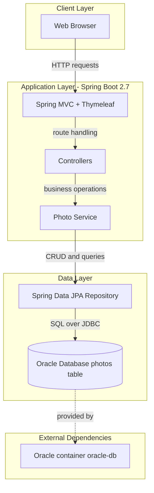
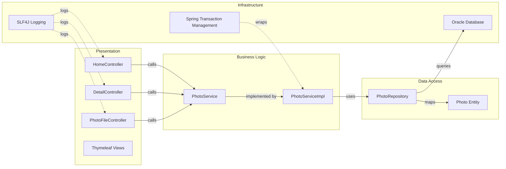

# Architecture Diagram

This document summarizes the current monolithic architecture of the Photo Album application and the primary runtime component interactions.

## Application Architecture

### Technology Stack Summary

| Layer | Technology | Version | Purpose |
|---|---|---|---|
| Presentation | Spring MVC + Thymeleaf | Spring Boot 2.7.18 | Server-side HTML rendering and form submission |
| Business Logic | Spring Service + Transactional | Spring Framework 5.3.x (via Boot 2.7.18) | Upload validation, metadata extraction, orchestration |
| Data Access | Spring Data JPA + Hibernate | Spring Data JPA 2.7.x (via Boot) | Repository abstraction and ORM |
| Database | Oracle Database via JDBC | ojdbc8 (runtime), Oracle Free image | Persistent BLOB storage for photo data |

### Data Storage & External Services

The application stores image metadata and binary photo content in a single Oracle database table (`photos`) using JPA and a BLOB column. It has no external API integrations or message brokers; its only runtime dependency is the Oracle database container/service.

### Key Architectural Decisions

- Uses a monolithic Spring Boot MVC architecture with controller-service-repository layering.
- Stores image bytes in Oracle BLOB fields rather than external object storage.
- Keeps upload validation rules in service-level logic using externalized application properties.

## Component Relationships

### Component Inventory

| Component | Layer | Type | Responsibility |
|---|---|---|---|
| HomeController | Presentation | MVC Controller | Renders gallery page and handles multi-file upload requests |
| DetailController | Presentation | MVC Controller | Shows single-photo detail page and performs photo deletion |
| PhotoFileController | Presentation | MVC Controller | Streams photo bytes as HTTP responses |
| PhotoService | Business Logic | Service Interface | Defines gallery, upload, navigation, and delete operations |
| PhotoServiceImpl | Business Logic | Spring Service | Implements validation, image parsing, and transactional operations |
| PhotoRepository | Data Access | Spring Data Repository | Provides CRUD and custom Oracle-native queries |
| Photo | Data Access | JPA Entity | Represents persisted photo metadata and BLOB content |
| Oracle Database | Infrastructure | Data Store | Stores persistent photo records |
