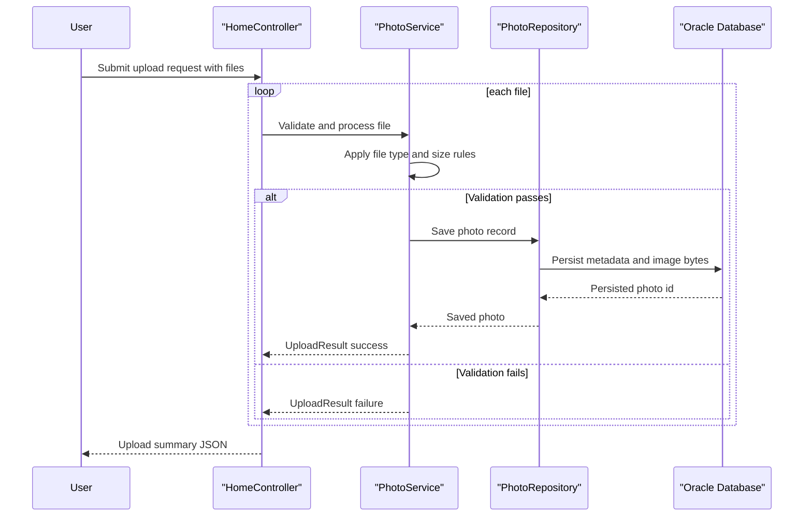

# Core Business Workflows

The application supports a photo gallery workflow where users upload images, browse the gallery, and view or delete individual photos. The business flow centers on reliable upload validation and chronological navigation through stored photos.

## Domain Entities

| Entity | Service / Bounded Context | Description | Key Relationships |
|---|---|---|---|
| Photo | photo-album / Gallery Management | Represents an uploaded image plus metadata used for listing and detail views | Referenced across upload, browse, detail, and delete operations |
| UploadResult | photo-album / Upload Processing | Captures per-file upload success/failure and error information | Produced by upload service and consumed by upload API response |

## Service-to-Domain Mapping

| Service | Domain Context | Owned Entities | External Dependencies |
|---|---|---|---|
| photo-album (Spring Boot monolith) | Gallery and Upload Management | Photo, UploadResult | Oracle database |

## Primary Workflows

### Workflow 1: Upload photos to gallery

Entry point: user submits `POST /upload` with one or more files.

1. Controller iterates through uploaded files and delegates each file to `PhotoService`.
2. Service validates MIME type and size thresholds.
3. Service extracts image dimensions and prepares a new `Photo` record.
4. Repository persists metadata and binary image data.
5. Controller builds success/failure response payload and returns aggregated JSON.

### Workflow 2: Browse, view detail, and delete photo

Entry points: `GET /`, `GET /detail/{id}`, and `POST /detail/{id}/delete`.

1. Gallery page loads all photos ordered by upload time.
2. Detail page fetches current photo plus adjacent previous/next photos for navigation.
3. File endpoint streams selected photo bytes for rendering.
4. Delete endpoint removes photo record and returns user-facing success/error flash state.

## Cross-Service Data Flows

No cross-service composition between multiple business services was detected. All business operations run inside a single monolith and directly access one Oracle datastore. Because there is no service mesh or downstream API dependency, no circuit-breaker fallback flow is implemented.

## Business Workflow Sequence

## Business Rules & Decision Logic

- Uploads are accepted only for allowed image MIME types (`jpeg`, `png`, `gif`, `webp`).
- Upload size must be positive and must not exceed configured max bytes.
- Upload processing is transactional at service layer, ensuring persisted data consistency per operation.
- Navigation logic computes previous and next photos by `uploadedAt` ordering.
- Deletion succeeds only when a matching photo record exists; otherwise user gets a not-found message.
- Authorization and role-based business access rules are not explicitly implemented in the application code.
