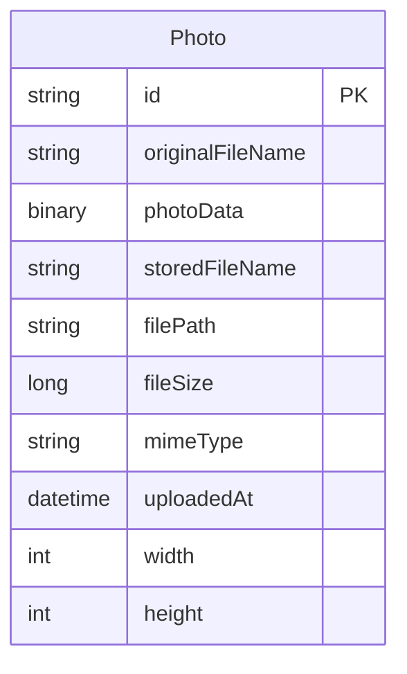

# Data Architecture & Persistence Layer

The application uses a single relational datastore with Spring Data JPA to persist photo metadata and binary image content. The persistence model is centered on one primary entity (`Photo`) mapped to an Oracle table.

## Database Configuration

| Service/Module | DB Type | Profile | Driver | Connection | Migration Tool |
|---|---|---|---|---|---|
| photo-album | Oracle | default | oracle.jdbc.OracleDriver (ojdbc8) | JDBC thin URL to oracle-db:1521/FREEPDB1 | None detected |
| photo-album | Oracle | docker | oracle.jdbc.OracleDriver (ojdbc8) | JDBC thin URL to oracle-db:1521:XE | None detected |
| photo-album tests | H2 (test dependency) | test execution | H2 driver (transitive use) | in-memory during tests | None detected |

## Data Ownership per Service

| Service | Tables Owned | ORM Framework | Caching | Notes |
|---|---|---|---|---|
| photo-album | `photos` | JPA/Hibernate via Spring Data JPA | none detected | Stores metadata and image BLOB in same table |

## Entity Model

## Key Repository Methods

| Service | Repository | Notable Methods | Purpose |
|---|---|---|---|
| photo-album | `PhotoRepository` | `findAllOrderByUploadedAtDesc()` | Fetches gallery photos newest-first |
| photo-album | `PhotoRepository` | `findPhotosUploadedBefore(LocalDateTime)` | Finds previous photos for detail navigation |
| photo-album | `PhotoRepository` | `findPhotosUploadedAfter(LocalDateTime)` | Finds next photos for detail navigation |
| photo-album | `PhotoRepository` | `findPhotosByUploadMonth(String, String)` | Oracle-specific month filtering |
| photo-album | `PhotoRepository` | `findPhotosWithPagination(int, int)` | Oracle ROWNUM pagination |
| photo-album | `PhotoRepository` | `findPhotosWithStatistics()` | Oracle analytic query for ranking/statistics |

## Caching Strategy

No explicit application caching layer was detected. The service reads and writes directly through JPA repository methods, with consistency managed through transactional boundaries (`@Transactional` on service implementation).

## Data Ownership Boundaries

The project is a single-service monolith with one logical data owner (`photo-album`) and one backing database schema/table. Cross-service data access patterns and CQRS boundaries are not present; all reads and writes go through the same repository abstraction.

### Data Classification & Sensitivity

| Entity | Sensitive Fields | Classification (PII/PHI/PCI/None) | Controls in Place |
|---|---|---|---|
| Photo | `originalFileName`, `photoData` | PII (potentially user-identifiable image/name content) | No explicit encryption-at-rest, masking, or field-level access controls detected in code/config |
