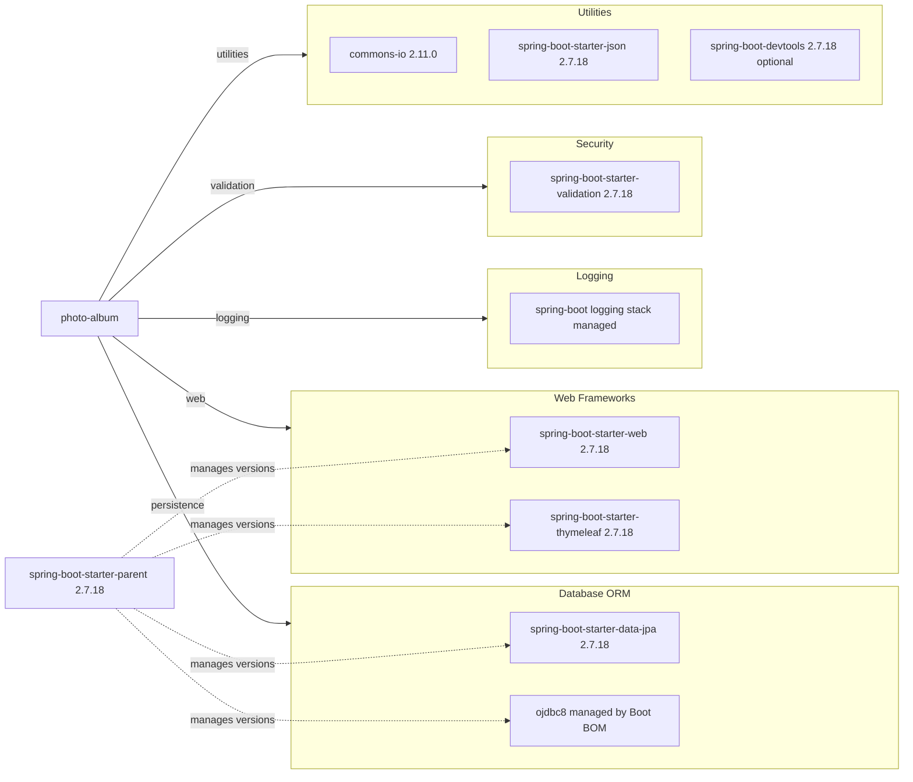

# Dependency Map

This map summarizes declared Maven dependencies for the `photo-album` application. The project declares 8 non-test dependencies and 2 test-scoped dependencies.

## Dependencies

### Dependency Summary

| Category | Count | Key Libraries | Notes |
|---|---:|---|---|
| Web Frameworks | 2 | spring-boot-starter-web, spring-boot-starter-thymeleaf | MVC + server-rendered pages |
| Database / ORM | 2 | spring-boot-starter-data-jpa, ojdbc8 | Oracle-specific runtime JDBC driver |
| Logging | 1 | Spring Boot logging stack | Via starter transitive dependencies |
| Security | 1 | spring-boot-starter-validation | Bean validation on domain objects |
| Utilities | 3 | commons-io, spring-boot-starter-json, spring-boot-devtools | File utilities, JSON support, local development support |

### Version & Compatibility Risks

The project targets Java 8 and Spring Boot 2.7.18, which is in maintenance mode and nearing end of support windows compared with newer LTS stacks. Oracle-specific SQL and runtime dependence on `ojdbc8` can increase migration effort to cloud-native data services.

### Notable Observations

- Dependency versions are mostly BOM-managed through `spring-boot-starter-parent`, reducing direct version drift risk.
- Oracle JDBC is runtime-scoped, tightly coupling runtime behavior to Oracle database availability.
- `commons-io` is one of few explicitly versioned third-party utilities.
- No dedicated observability library (e.g., micrometer registry exporters) is declared.

## Test Dependencies

| Framework | Version | Notes |
|---|---|---|
| spring-boot-starter-test | 2.7.18 | Primary test bundle (JUnit/Mocking support transitively) |
| h2 | managed by Boot BOM | In-memory test database |

Total test-scope dependencies: 2

The test stack is minimal and suitable for unit and basic integration testing. No Testcontainers or contract-testing framework is declared.
